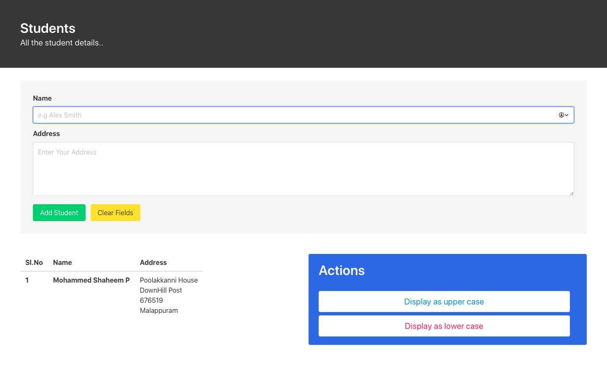

# RESTful API using Node.js and Client Application


## Contents
- A RESTful API which has to endpoints to convert strings to capital letters and small letters
- A client web application which works with the above API

## How to Run

#### Get the Project
```zsh
git clone https://github.com/shaheemMPM/WebTechnology-Assignment1.git
```

#### Run Web Server
```zsh
cd WebTechnology-Assignment1/server/RESTful API
npm install
npm start
```

#### Run Web Client
- Open **script.js**  from *WebTechnology-Assignment1/client/public/js*
- Edit url of post script from heroku API to localhost:3000 [line 77 and 95]
- Now open index.html from *WebTechnology-Assignment1/client/public* in a browser

## Demo

[Client Application](http://webtechnology-restapi.web.app/)


